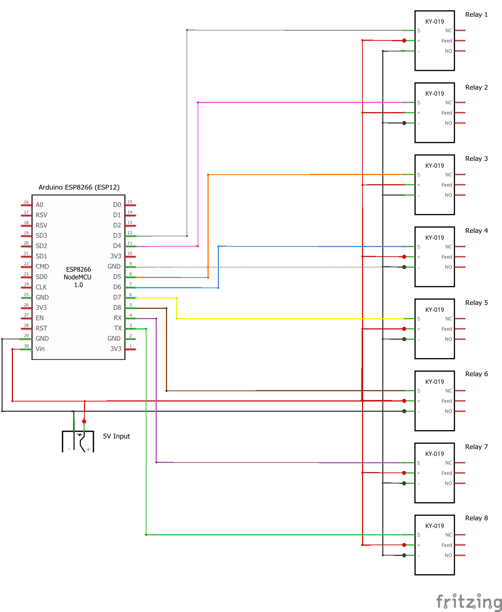

<!DOCTYPE html>
<html>
	<body>
		

			

				
					

						<<<<< wittinobiArduinoSwitchASCOMv1wifiDRIVER >>>>>
					

				
				
					

						 
						

						<<<<< Info >>>>>
						 
						ASCOM Driver v1.0.0 for Arduino ESP8266 (ESP-12e) with 8Channel Relay Switch.
						 
						<a href="wittinobiArduinoSwitchASCOMv1wifiREADME/ASCOM.wittinobiArduinoSwitchASCOMv1wifiDRIVER.Switch.x86.Validation.txt" target="_blank">
						ASCOM.wittinobiArduinoSwitchASCOMv1wifiDRIVER.Switch.x86.Validation.txt
						</a>
						 
						<a href="wittinobiArduinoSwitchASCOMv1wifiREADME/ASCOM.wittinobiArduinoSwitchASCOMv1wifiDRIVER.Switch.x64.Validation.txt" target="_blank">
						ASCOM.wittinobiArduinoSwitchASCOMv1wifiDRIVER.Switch.x64.Validation.txt
						</a>
						 
						 
						

						<<<<< Steckplatine >>>>>
						 
						
						 
						 
						

						<<<<< Schaltplan >>>>>
						 
						
						 
						 
						

						<<<<< Driver >>>>>
						 
						
						 
						 
						

						<<<<< App >>>>>
						 
						
						 
						 
						

						<<<<< INO >>>>>
						 
						
						 
					

				
			

		

	</body>
</html>
